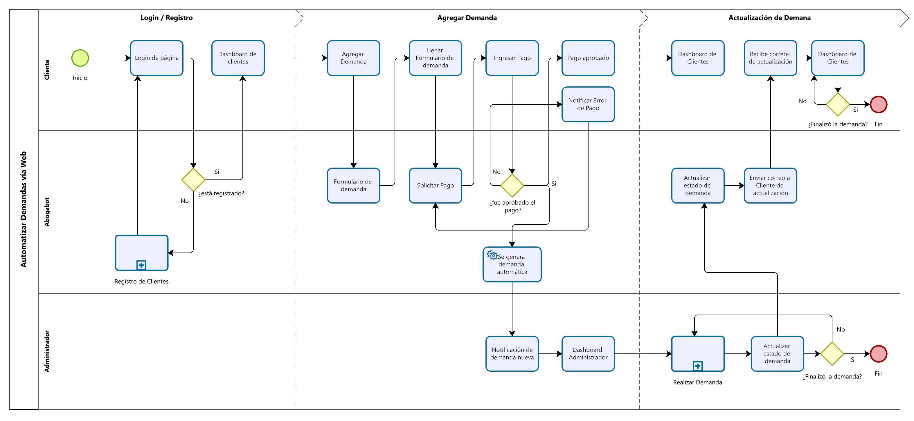
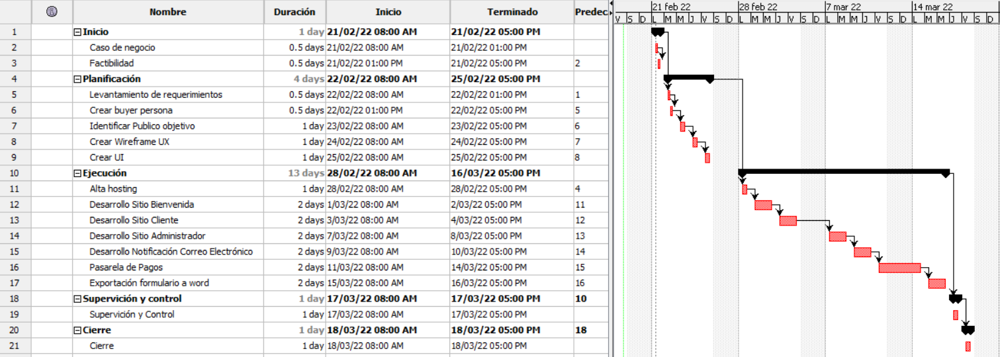
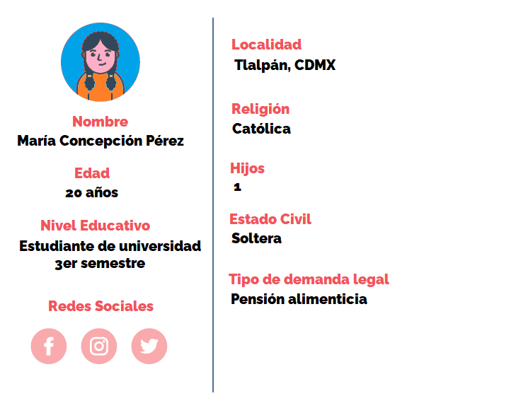
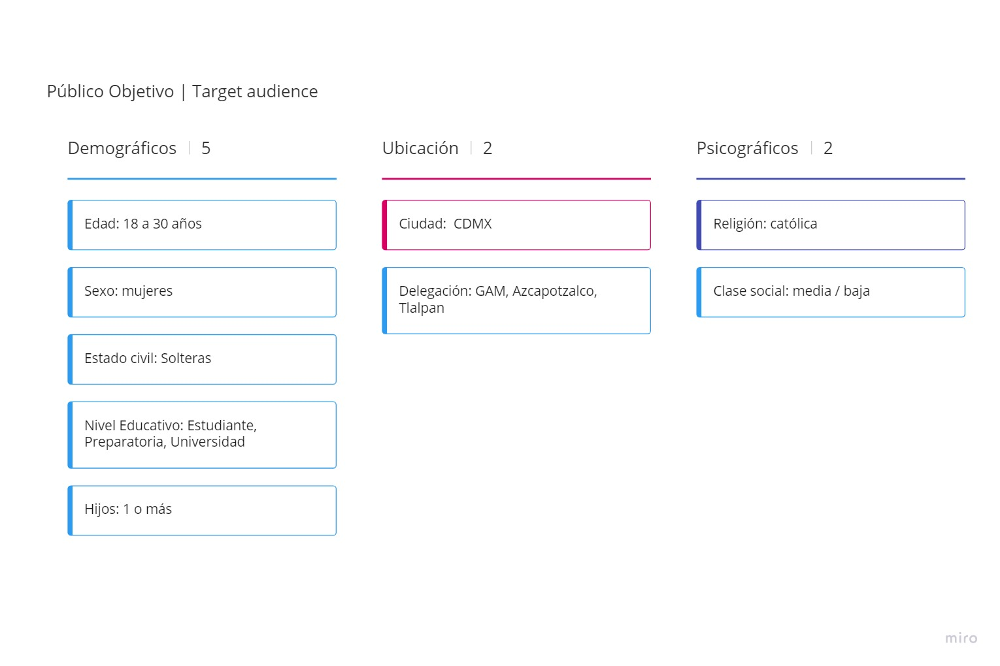

# FrontEnd-Mision-Training🚀

### Prácticas de Intro a Frontend

1. [Toma de requerimientos](https://github.com/doguedogue/FrontEnd-Mision-Training/tree/main/Pr%C3%A1ctica%201/1.-Requerimientos%20Abogabot.doc)
2. Buyer Persona
3. Público objetivo
4. ~~Wireframe UX~~
5. ~~UI~~

### 1) [Toma de requerimientos](https://github.com/doguedogue/FrontEnd-Mision-Training/tree/main/Pr%C3%A1ctica%201/1.-Requerimientos%20Abogabot.doc)

### Caso: Abogabot

### Descripción:

Es un despacho de abogados que quiere automatizar las demandas de sus clientes, esto lo harán a traves de una página web llenando un formulario

### Modelamiento del negocio

### Diagrama de Planeación

### 2) Buyer Persona

### 3) Público objetivo

